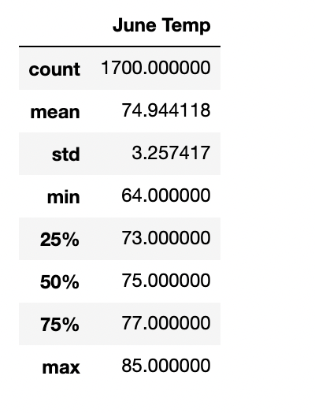
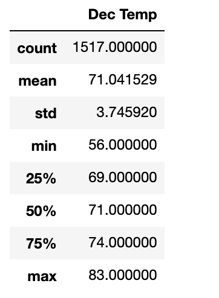

# Surf n' Shake Analysis

## Overview
### Previous Analysis
Since my visit to the beutiful state of Hawaii, I have been dying to find a way to get back to move to Hawaii permanently. The entrepreneurial spirit in me has compelled me to open a shop near the water this shop would sale surf board and ice-cream to everyone, and I will call it "Surf n' Shake". A famous investor with a passion for surfing likes the idea, but has asked me to gather more data on the weather, as parts of Hawaii see a lot of rain which can easily affect the sale of a beach themed shop. My initital analysis of temperature and precipitation for the investor found very compelling evidence that there would not be too much instability for the surf shops location. 

### New Analysis

While the previous analysis provided solid evidence, we now have one more task, which is to find statistics on temperature for June and December. Naturally analysising the temperature of these two months for Hawaii makes perfect sense, June presents the biggest potential for revenue as it marks the beginning of the hot summers, and December marks the beginning of winter which should not boad well for a surf and ice-cream shop. Analyzing these two polar opposite weather patterns will really show how well this surf shop can perform year round. 

## Results

- June Temps: Mean = 74.9

- December Temps: Mean = 71.0

- Min Temps:
  - June Temps: 64.0
  - December Temps: 56.0

## Summary

### Analyzing Mean
There are some really good signs from our analysis of we see that the mean temperature for June is about 75 degrees with a standard deviation of 3.25, and that the mean for 71 degrees with a standard deviation of 3.75. The mean between the two opposite months are only 4 degrees apart, this tells us that on average Hawaii is able to maintain consistent temperatures. 

The standard deviations are also relatively small compared to our data, which tells us that we will typically not stray too far from our mean. 

### Minimum
The one concern is that the lowest temperature on record for December was 56 degrees. That is definetely an issue, as we can imagine sub 60 temperatures does not make good for surfing or ice-cream. 

### Conclusion
While the rest of our statistics show a very positive outlook for "Surf n' Shake", it is clear that the lows expereinces in December and the winter months need to be taken into account. The minimum temperature recorded in December informs us that we need to be preapred for slow days or even weeks during the winter season. Overall the shop seems to be on track for success thanks to the beurtiful weather in Hawaii.  
